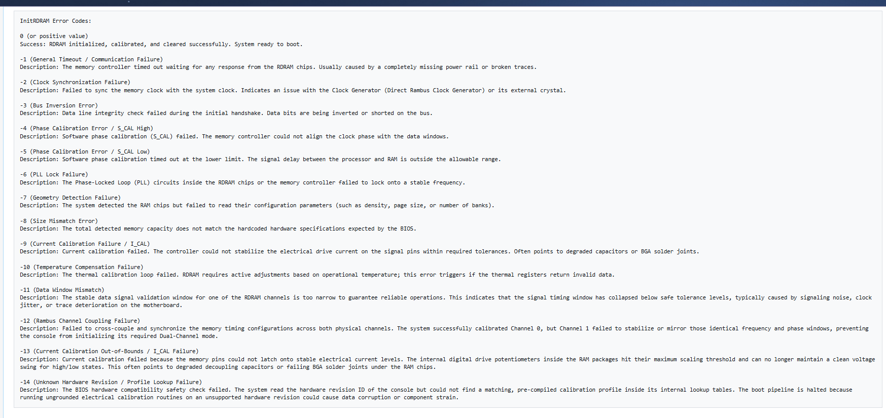
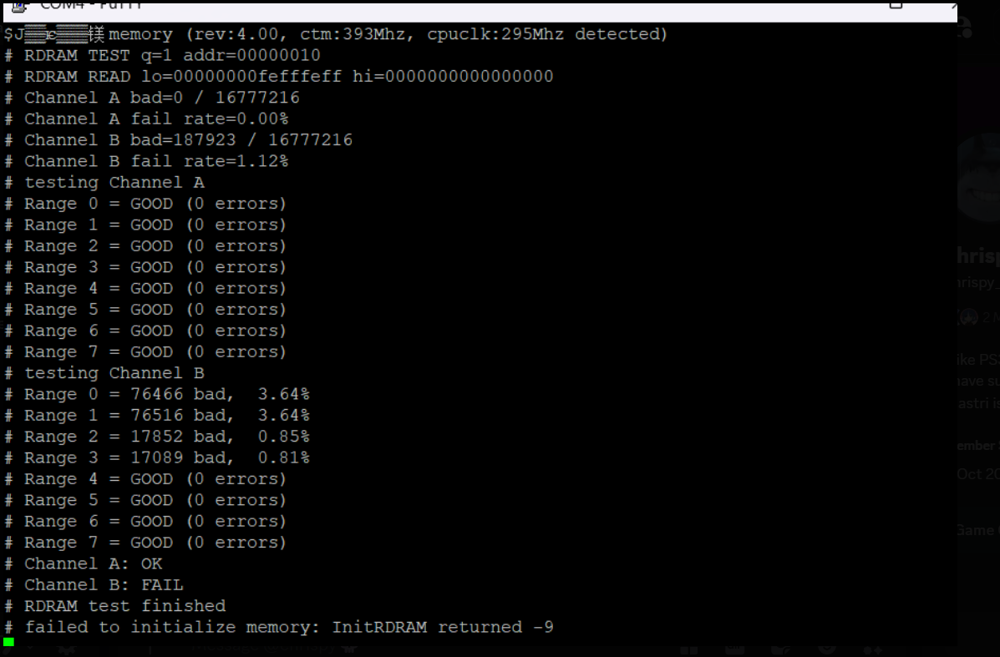

PS3 PS2 RDRAM Test Tool ver 0.1

An experimental diagnostic tool for testing the 32 MB of PS2 RDRAM in early backward-compatible CECHA/B PlayStation 3 consoles (i.e. only COK-001 motherboards). 

It is intended for consoles with "nops2" fault where EEGS UART displays an error such as: "failed to initialize memory: InitRDRAM returned -X". 

*You can also check some of the return codes through the link here (made by Kozarovv): https://www.psdevwiki.com/ps3/index.php?title=User_talk:Kozarovv&curid=9418&diff=78129&oldid=78114

The RDRAM test framework is adapted from krat0s’ tester. The current diagnostic build adds a full-memory write/read test using fixed patterns and reports results by Channel A/B and Range 0–7. Each pattern is written across the memory and then read back in a separate pass. This helps detect stuck bits, address-related faults and memory locations that do not retain the written value. The ranges are logical 4 MB address windows across the 32 MB memory space. They are not physical data lanes.

On COK-001 motherboards, the channels should correspond to:

Channel A	- IC7002 (leftside rdram)  
Channel B	- IC7003 (rightside rdram) 

Example result:

A failed channel does not always mean that the RDRAM chip itself is defective. The failure may also be caused by bad solder joints, damaged traces, unstable power, missing signals or a fault in the memory controller.

Requirements:

-A backward-compatible PS3 with nops2 fault (CECHA or CECHB models ONLY) 
-CFW or a suitable development environment 
-Devblind or similar tool to enable writing to dev folder 
-EEGS UART Adapter (same as for Syscon) 

Installation:

-Before doing anything, solder your UART adapter according to the picture. 
-Run devblind and enable it. 
-Go to devblind folder through Irisman or any other file manager, locate ps2emu folder and replace ps2_emu.self file. 
-Optionally restart the system. 
-Open Serial terminal using program such as Putty, use 38400 baud. 
-Run a ps2 game and wait a little bit for the test results to show up.  

After repair:

**IMPORTANT: After you have repaired RDRAMs and the tool displays 0 errors, you will not be able to boot the games as normal. The test will run in a loop. You must put the original ps2_emu.self file back in order to restore original ps2 functionality.**

Credits:

The base ps2emu version is taken from here - https://www.psx-place.com/resources/release-ps2_emu-gxemu-and-netemu-modded-by-kozarovv-fan-control-cell-rsx-temps-fps-indicator.1680/ 

Original RDRAM testing logic by krat0s - https://www.psx-place.com/resources/ps2-rdram-test-by-krat0s.899/

PS3 integration, channel/range diagnostics and UART output by Calyps0/Chatgpt.

**Disclaimer:**

THIS IS AN EXPERIMENTAL REPAIR AND RESEARCH TOOL. USE AT YOUR OWN RISK.**
